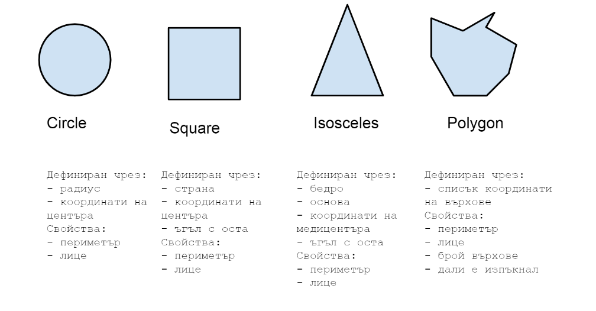
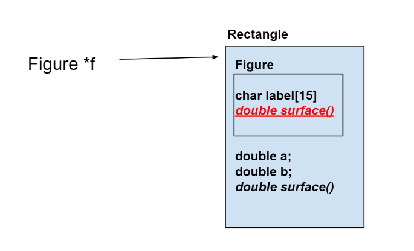

# Упражнение 13

## Какво правихме предния път?

- множествено наследяване
- ред на наследяване
- "диамантеният проблем"
- виртуални базови класове

## Виртуални функции:

Виртуалните функции са методи на базов клас и тези функции трябва да бъдат предефинирани(overridde) в класовете наследници(derive class).
Виртуалните функции гарантират, че е извикана правилната функция.

Виртуалните функции се декларират с ключовата дума virtual

Пример:

```c++
class Base {
public:
    virtual void print()
    {
        cout << "print base class\n";
    }
};

class Derived : public Base {
public:
    void print()
    {
        cout << "print derived class\n";
    }
};
```

## Чисто виртуални функции(pure virtual function):

Чисто виртуални функции са функции, които нямат имплементация. Имплементацията ще бъде написана от класа наследяващ базовия клас.

Пример:

```C++
class Base
{
    // Data members of class
public:
    // Pure Virtual Function
    virtual void show() = 0;


   /* Other members */
};
```

## Полиморфизъм:

Време е да дадем пълна дефиния за последния, но не на последно място, ООП принцип - полиморфизмът. Полиморфизъм буквално преведено означава "много форми" (от poly - много, morphius - форми) или това практически е свойството на даден елемент да приема повече от една форма. Още по-конкретно в C++ всички наследници на един клас да могат да се "държат" като него и да могат да извършват всички негови функционалности.

Използваме го, когато един обект има различни поведения при различни ситуации.
Съществуват два типа полиморфизъм:

- **compile time** - този тип полиморфизъм се осъществява чрез function или operator overloading или предефиниране на оператор/функция.

  - предефиниране (**overloading**) на функции
    Пример:

    ```C++
    class FunctionOverload
    {
    public:
        // 1 параметър int
        void func(int x)
        {
            cout << "value of x is " << x << endl;
        }

        // 1 параметър double
        void func(double x)
        {
            cout << "value of x is " << x << endl;
        }

        // 2 параметъра
        void func(int x, int y)
        {
            cout << "value of x and y is " << x << ", " << y << endl;
        }
    };

    int main() {

        FunctionOverload obj1;

        // Коя функция от трите ще се изпълни, зависи от това какви параметри подаваме
        // Това вече сме го говорили.
        obj1.func(7);

        obj1.func(9.132);

        obj1.func(85,64);
        return 0;
    }
    ```

  - предефиниране (**overloading**) на оператори:

        Пример:

    ```c++
    class Complex {
    private:
        int real, imag;
    public:
        Complex(int r = 0, int i =0)  {real = r;   imag = i;}

        // това се вика автоматично при "сбор" на две комплексни числа
        Complex operator + (Complex const &obj) {
            Complex res;
            res.real = real + obj.real;
            res.imag = imag + obj.imag;
            return res;
        }
        void print() { cout << real << " + i" << imag << endl; }
    };

    int main()
    {
        Complex c1(10, 5), c2(2, 4);
        Complex c3 = c1 + c2;
        c3.print();
    }
    ```

- **runtime** - възможно е чрез така нареченото **overriding** на функции - по-точно когато наследник на базов клас предефинира негова виртуална функция.

      Пример:
      ```c++
      class base {
      public:
          virtual void print()
          {
              cout << "print base class\n";
          }

          void show()
          {
              cout << "show base class\n";
          }
      };

      class derived : public base {
      public:
          void print()
          {
              cout << "print derived class\n";
          }

          void show()
          {
              cout << "show derived class\n";
          }
      };

      int main()
      {
          base *bptr;
          derived d;
          bptr = &d;

          // виртуална функция - runtime
          bptr->print();

          // стандартна функция - compile time
          bptr->show();

          return 0;
      }

  Изход:

```
print derived class
show base class
```

### Време е да видим проблем, който се решава именно с виртуалните функции.

```c++
class Entity {

};

class Player {

};
```

## override

Използва се при дефиницията на виртуалния метод в наследниците. Може да ги възприемате като двойка - в базовия клас обозначаваме `virtual` един път, а за всеки наследник на базовия клас, който имплементира този метод при неговата дефиния обозначаваме `override`. Това НЕ Е задължително, за да осъществите правилното поведение на виртуалната функция, но е доста добро за четимост и компилаторът ще ви хвърли грешка, ако в бъдещете промените името на виртуалната функция - ще ви каже къде трябва да я промените надолу по веригата (в кои наследници).

## Абстрактни класове (преговор):

Абстракция - показване на нужната информация и скриване на детайлите.
Абстрактен клас е клас, който съдържа поне една pure virtual функция.

Пример:

```c++
class Base
{
	int x;
	public:
	virtual void show() = 0;

    int getX() { return x; }
};

int main(void)
{
	Base t;
	return 0;
}
```

Този пример ще доведе до compile error, защото не могат да бъдат създавани обекти от абстрактен клас.

Можем да създаваме референции от абстрактни класове, които да сочат към обекти от класове насладници на абстракния клас, които са имплементирали всички виртуални методи.
Ако класът наследник на абстрактия клас не предефинира виртуалните функции той също става абстарктен клас. Сега ще видим употребата на абстрактни класове като референции и как можем да създаваме масиви от тях и обхождаме.

### Масив от фигури

Предният път разгледахме как можем да "третираме" различни фигури (кръг, квадрат, триъгълник...) просто като **Фигура**. За целта създавахме указатели към фигура, които инстанцираме с конструктора на съответния наследник.

```c++
Figure* figure1 = new Circle(5);
Figure* figure2 = new Rectangle(1,2);
Figure* figure3 = new Square(5);
```

За да можем да работим с масив от `Figures` като използваме двоен указател.

```c++
Figure** figures = new Figure*[3];
```

## Еднакви vs. Различни



Множество от "различни обекти"

_псевдо код_

```c++
Square* squares[] = { ... };
Circle* circles[] = { ... };
Triangle* triangles[] = { ... };
```

Множество от "еднакви"

_псевдо код_

```c++
Figure* figures[] = { new Square, new Circle ... }
```

**Указатели от Figure към Rectangle**




## Шаблони на функции

_Шаблони на функции и класове (полезна връзка за четене, cplusplus) - [templates](http://www.cplusplus.com/doc/oldtutorial/templates/)_

Шаблоните на функции са специални функции, които могат да работят с много различни типове. Това ни позволява да създадем шаблон за функция, чиято функционалност може да бъде адаптирана към повече от един тип или клас данни, без да се повтаря код за всеки отделен тип.

В C ++ това може да се постигне, като се използват **параметри на шаблона**. Това е специален вид параметър, който може да се използва за предаване на тип като аргумент: точно както обикновените параметри на функцията могат да се използват за подаване на стойности към дадена функция, параметрите на шаблона позволяват да се подават типове на функции.

Форматът за деклариране на шаблони на функции с **типови параметри** е:

```c++
template <class identifier> function_declaration;
template <typename identifier> function_declaration;
```

Шаблонът на функцията започва с ключовата дума template, последван от параметър(и) на шаблона вътре в <>,
което е последвано от дефиницията на функцията.

```
template <typename T>
T functionName(T parameter1, T parameter2, ...)
{
    //...
}
```

В горния пример - T е шаблонен аргумент, който приема различни типове данни (int, float и т.н.), а typename е ключова дума.
Когато аргумент от тип данни се предаде на functionName(), компилаторът генерира нова версия на functionName() за дадения тип данни.
(В горния пример резултатът, който функцията връща също е от указания тип - Т)

## Извикване на шаблон на функция:

След като сме декларирали и дефинирали шаблон на функция,
можем да го извикаме в други функции или шаблони (като функцията main()) със следния синтаксис :

```c++
functionName<dataType>(parameter1, parameter2,...);
```

-експлицитно обявяваме типа на данните с които искаме функцията да работи, записвайки типа - dataType в <> след името на функцията

Пример:

Функция, която събира две числа от произволен тип и връща като резултат тяхната сума:

```c++
template <typename T>
T add(T num1, T num2)
{
   return (num1 + num2);
}
```

Можем да извикаме функцията в main() - за int и double

```c++
int main()
{
    int result1;
    double result2;

    // calling with int parameters
    result1 = add<int>(2, 3);
    cout << result1 << endl;

    // calling with double parameters
    result2 = add<double>(2.2, 3.3);
    cout << result2 << endl;

    return 0;
}
```

```
output:

    2 + 3 = 5

    2.2 + 3.3 = 5.5
```

ВАЖНО функцията в горния пример няма да работи за типове, за които не е дефинирана операцията '+' (например, ако сме си дефинирали клас, в който не сме имплементирали операцията '+')

#### NB! И двата прототипа имат точно същото значение и се държат по същия начин.

#### Пример:

```c++
template <typename T>   // T e параметър на шаблона - това е типа, който по време на дефиницията на функцията не искаме да посочваме
T max_of_two (T a, T b) {
    return (a > b? a : b);
}
```

Когато искам е да извикаме функцията за определен от нас тип, тогава:

```c++
int main()
{
    int first = 5, second = 12;

    cout << max_of_two <int> (first, second); // посочваме типа при извикването на функцията

    return 0;
}
```

Какво се случва зад колисите: Когато компилаторът срещне това извикване на шаблона, той използва шаблона, за да генерира автоматично функция, заменяща всяко срещане на типа T с типа, подаден като параметър (int в този случай), и след това я извиква. Този процес се изпълнява автоматично от компилатора и е невидим за програмиста.

#### Можем да добавяме няколко параметъра на шаблона => няколко различни типа

```c++
template <typename T, typename S>
void print_pair(T a, S b) {
	cout << a << " and type is: " << typeid(a).name() << endl;
	cout << b << " and type is: " << typeid(b).name() << endl;
}
```
